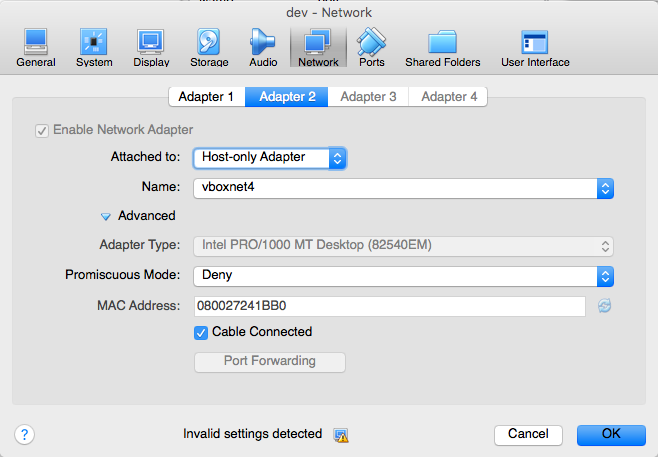
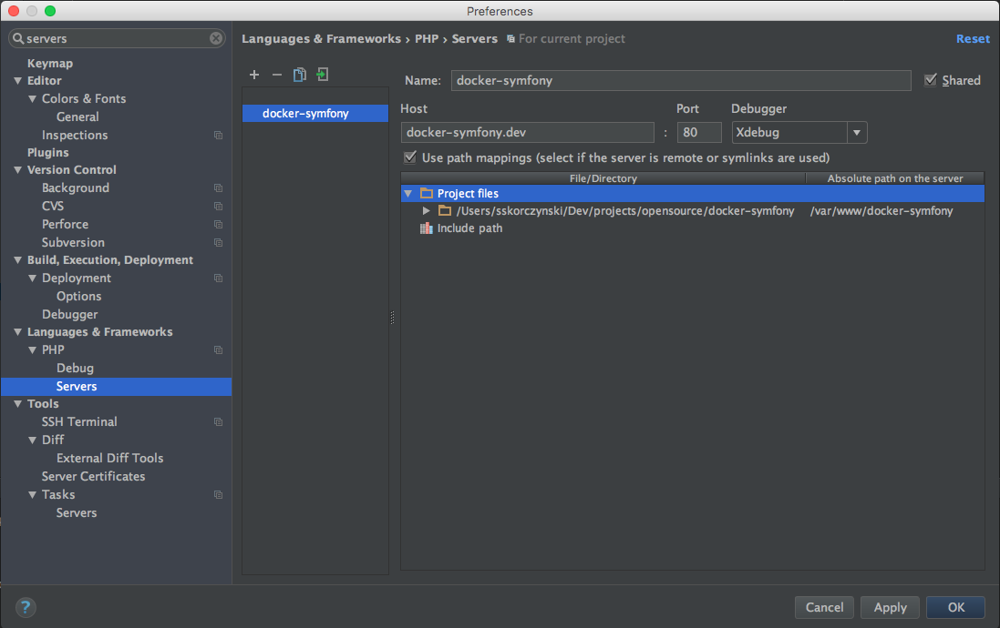

# Debugging on Docker container with Xdebug in PHPStorm
[Xdebug](https://xdebug.org/) is a very powerful tool to debug PHP applications in the IDE in a professional way. To
make it work you need configure Xdebug extension on the machine (container) you run your PHP app and then configure your
IDE on the host machine. Here's the "step-by-step" instruction that can help you doing it.

## Remote configuration
First, you need to configure the `php` Docker container to use Xdebug. This repo has already done and ready
configuration of the container to run Xdebug. It consists of:

1. Xdebug installation in the `Dockerfile`.
2. Xdebug configuration in the `php.ini` file.
3. Further Xdebug configuration in the `docker-compose.yml` file (two environment variables for `php` container).

## Local configuration
Disclaimer: this instruction was tested on Mac OS X with Docker Machine, VirtualBox and PHPStorm 10.

### 1. Set the IP address of your host

First, you need to set the IP address of your host machine in the `docker-compose.yml` file:

```
XDEBUG_CONFIG: remote_host=192.168.99.1
```

You need to restart the environment (`docker-compose restart -d`) to apply the change.

This IP should be visible from the container. The actual IP and the way to retrieve it depends on the OS you use as the
host as well as a type virtualization you use to run Docker Engine (if you use any).

Assuming you use Mac OS X and you have Docker Machine with VirtualBox to run Docker Engine, you can check the IP using
`ifconfig` command. The IP you're looking for is define in one of the `vboxnet` interfaces. If you're not sure which
interface is used by the virtual machine, you can find it out in VirtualBox GUI:

1. Select "Setting" (&#8984;S on Mac OS X) your Docker Machine
2. Go to "Network"
3. On the list of adapters, look for "Host-only adapter"
4. The name of the interface should be right below:


### 2. Adjust remote server configuration in PHPStorm

In PHPStorm go to Preferences (&#8984;, on Mac OS X), open "Languages & Frameworks > PHP > Servers" and add new server
configuration. The name of the server should be "docker-symfony" (you can set any name you want, but remember to use the
same name in the `docker-compose.yml` file) and the host should be `docker-symfony.dev`. You need to also prepare valid
file mappings configuration. The directory of the repo should map `/var/www/docker-symfony` directory on the server.



### 3. Enable PHP debug connection in PHPStorm

In PHPStorm click the icon with a phone handset - this starts/stops listening for PHP debug connections. This should be
in "started" status:


### 4. Debug!
Place a breakpoint somewhere in the code and then use the app. You can open it in the browser, call REST API, use
Symfony CLI command or run PHPSpec - Xdebug should work for any of the app's endpoints.
